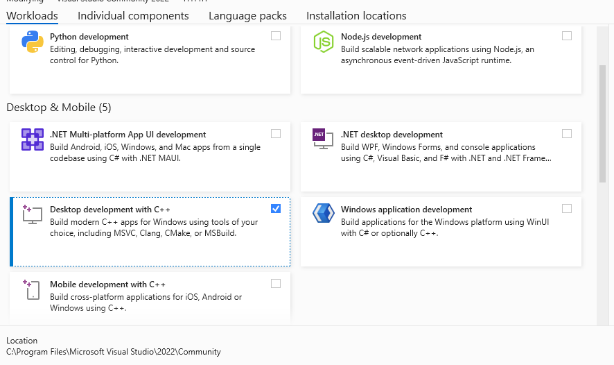
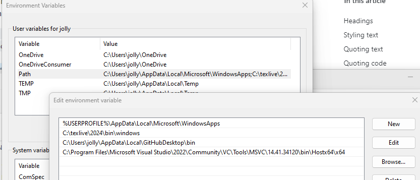
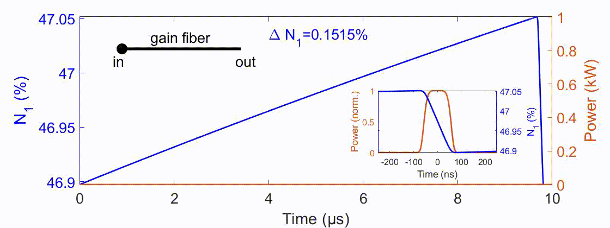
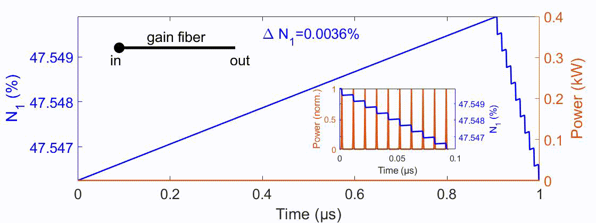
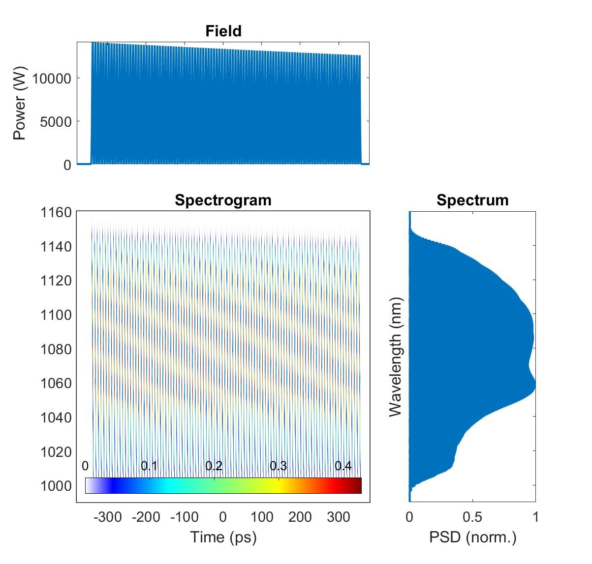
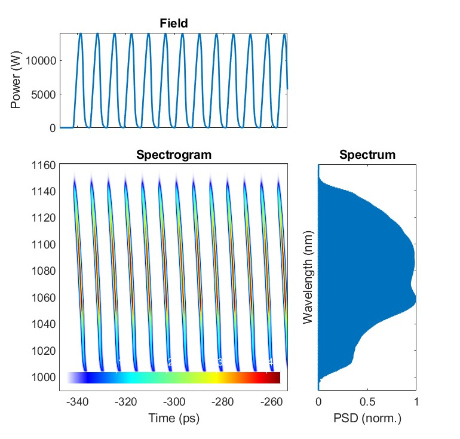

# Transient_rate_gain
 This is the shared package to simulate pulse propagation in a (solid-core) fiber amplifier with UPPE incorporated with the transient rate-equation gain.

 This is by far the fastest and memory-saving transient-gain model in the world due to the field-based treatment.

> [!NOTE]
> I've been modifying the code to make it user-friendly since it was written for our Optica paper. Hence, the paper example codes might fail due to a changed coding format or function name. I'll fix them soon, but it'll take some time. If users want to try the code before I'm done, in principle, users can fix the bugs themselves with the help of readme.pdf in the /Documentation folder.
> 
> I'm busy with other projects. From the current progress, I might come back to this in about half a year to a year. That said, if you need to use this code and has questions, it might be faster to send me an email, which you can find in the paper. Sorry for the inconvenience. Ultimately, I hope to make this Github page with some animation examples as my other repositories here.
> 
> 9/28/2025: I kinda fixed bugs for periodic codes (`For repetitive pulses (stochastic noise)`). I assume '`For non-repetitive pulses (stochastic noise)` is still not working, which I'll fix in the future.

## Capabilities:
1. It solves the pulse propagation with [RK4IP](http://www.sciencedirect.com/science/article/pii/S0010465512004262) (Runge-Kutta under the interaction picture).

> [!NOTE]
> I know that split-step algorithm is common, but I'd like to advocate people to switch to RK4IP since RK4IP has a higher-order truncation error, which allows higher precision or larger step size (and faster simulation).

2. Adaptive step-size control is implemented for RK4IP, which improves the performance and allows users to be free from worrying the reliability of a simulation. Only when considering ASE is adaptive-step method turned off. User doesn't choose whether to use the adaptive-step method, which is controlled by this package.
3. Support broadband scenarios by having $\beta(\omega)$.
4. It currently supports only scalar (single-spatial-mode and linearly-polarized) scenarios.
5. Support rate-equation-gain models:
   - All pumping schemes are implemented: co-pumping, counter-pumping, co+counter-pumping, as well as with and without ASE.
   - If ASE is included, the effect of ASE to the coherent signal field is simulated.
   - Rate-equation model supports `Nd`, `Yb`, `Er`, `Tm`, `Ho`. For more details, see `readme.pdf`.
7. Support noise-seeded processes, such as spontaneous Raman scattering, with [the newly-developed noise model](https://doi.org/10.48550/arXiv.2410.20567).
8. Support GPU modeling. It is controlled by `sim.gpu_yes=true/false`.

## Fourier-Transform tutorial
Since I've seen many misuse of Fourier Transform, I wrote [this tutorial](https://doi.org/10.48550/arXiv.2412.20698). Please take a look. Briefly speaking for one misuse, it's necessary to use MATLAB's `ifft` for Fourier Transform into the spectral domain.

## How to activate CUDA for GPU computing in MATLAB:
Typically MATLAB deals with this, but there are still come steps to follow before CUDA can really be used, especially when compiling .cu files to generate .ptx files. Below I show only steps for Windows. For linux, please search for their specific steps. I've never used Mac, so I cannot comment anything on this; some functions need to be revised for extended capabilities for Mac as far as I know. 
1. Install [CUDA Toolkit](https://developer.nvidia.com/cuda-toolkit)
2. Install [Visual Studio Community](https://visualstudio.microsoft.com/vs/community/). Only **Desktop development with C++** is required. If it later says that it needs to install some other components due to the dependency issues, also install them.

3. Add required path of Visual Studio to computer's environmental PATH; otherwise, MATLAB, during compiling .cu files, will say "cl.exe" cannot be found.

4. Restart the computer if something is wrong. Connections between MATLAB and CUDA or Visual Studio requires restarting to be effective.
> [!WARNING]
> MATLAB supports only a certain version of CUDA and GPUs ([support list](https://www.mathworks.com/help/releases/R2021b/parallel-computing/gpu-support-by-release.html)). CUDA or GPU that is too old just isn't supported.

## Reference (our paper):
1. [Transient gain](https://doi.org/10.1364/OPTICA.557373)

## Demonstrations:
- **Amplification of a nanosecond pulse**  
A long ~100-ns pulse is amplified. Due to its long duration and strong amplification, it exhibits transient-gain effect, such that the temporal trailing edge experiences less gain than the leading edge.   
Source: "For repetitive pulses (stochastic noise)/Examples/Tutorials/Transient-gain demonstration (ns pulse)"  

- **Burst-mode CPA**  
A 10-pulse burst, each stretched to 500 ps from 400 fs, is amplified. Similar to aforementioned nanosecond-pulse amplification, it exhibits transient-gain effect, such that the temporal trailing edge experiences less gain than the leading edge.   
Source: "For repetitive pulses (stochastic noise)/Examples/Tutorials/Burst-mode CPA"  

- **Burst-mode GMNA**  
A 100-pulse burst is amplified into the gain-managed nonlinear regime (GMNA) [[1]](#references-our-papers). Only our field-based model can capture their spectrotemporal evolutions exhibiting a frequency-shifting gain spectrum, also with different gains, in different temporal slices of the fields due to the transient-gain effect. Pulses at the trailing edge is slightly more narrowband than those at the leading edge (spectrogram plotted below ignores temporal interference for visualization purpose). Since the phase in GMNA is generated nonlinearly, pulses in this burst have different phases and thus cannot be uniformly dechirped.   
Source: "For repetitive pulses (stochastic noise)/Examples/Tutorials/Burst-mode GMNA"  

## History:
* 9/28/2025: 
I kinda fixed bugs for periodic codes (`For repetitive pulses (stochastic noise)`). I assume '`For non-repetitive pulses (stochastic noise)` is still not working, which I'll fix in the future.